## Introduction

In September 2025, the Bedford Board of Health made the decision to suspend Bamboo's restaurant permit. This decision was made after numerous attempts of correcting the health violations and even employing a food safety consultant. Bamboo was found violating many food safety standards, the article by The Bedford Citizen states, "issues involving storage, temperature control, cross-contamination, equipment cleanliness, cold and hot holding, and pH testing"(Pavelich, 2025). Such violations pose serious risks to public health, as improper food handling and sanitation can lead to foodborne illness and community-wide exposure. This recent event demonstrates how serious the consequences of repeated noncompliance can be and highlight the importance of routine inspections, regulatory oversight, and early intervention.

For our project we wanted to analyze inspection data to better when and why violations might occur. We did this by examining violations from food establishments in Boston, New York City (NYC), Chicago, and San Francisco. The dataset consists of thousands of food inspection records from publicly available health department data in Boston, New York City, Chicago, and San Francisco. These records include information such as inspection dates, violation types, risk levels, etc. Our final dataset, after merging, had around 1.5 millions records, spanning twenty years. In this data, we are looking to compare, contrast, and find relationships between variables related to common overall violations within each city, year, type of establishment, type of violation, and other variables.

Our setup looks to be for each of us to thoroughly research and analyze an individual question related to common food establishment violations. Our research questions are as follows:

Q1. What is the pattern of violations geographically within Boston? What is the distribution of restaurants within the city? Is there any correlation between restaurant density (the amount of neighbor restaurants within a certian radius) and food inspection pass rates?

Q2. Do specific categories of restaurants (e.g., 'Pizza', 'Sushi', 'Coffee Shop') disproportionately receive certain categories of violations (e.g., 'Pest Control', 'Food Temperature', 'Employee Hygiene')?

-   How do the types and severity (risk level) of violations found during 'Complaint-Driven' inspections differ from those found during 'Routine' inspections?

Q3. What month and season has the most food inspection violations across each city? Overall?

-   When do certain types of violations (e.g., temperature issues, pests, hygiene) peak?

Q4. What is the trend of most frequent violations been over time? For example, what are the most common violations in 2015 overall vs in 2020? Why?

We used several libraries to complete data cleaning and visualization including including tidyverse, sf, lubridate, tidytext, scales, viridis, and ggplot2.

## Exploratory Data Analysis

### Data Integrity and Standardization

Our initial analysis confirmed the combined dataset of over 1.4 million records is large and recent (mostly post-2005), but critically **imbalanced** (Boston accounts for over half the data). This required our team to rely exclusively on **proportional analysis** for all city comparisons to ensure fair results.

We successfully transformed disparate risk columns into a unified, easy-to-understand Risk Level variable:

| City              | Original Column Examples           | Standardized To   |
|:------------------|:-----------------------------------|:------------------|
| **Boston**        | `***`, `**`, `*`                   | High, Medium, Low |
| **New York City** | `Critical`, `Not Critical`         | High, Low         |
| **Chicago**       | `Risk 1 (High)`, `Risk 2 (Medium)` | High, Medium, Low |

### Key Cross-City Findings

| Finding | Summary | Plot Reference |
|:-----------------------|:-----------------------|:-----------------------|
| **Inspection Outcome Bias** | Boston and San Francisco log the highest proportion of "Fail" outcomes, while New York City's system is highly skewed toward "Pass" (Grade A). This confirms that "Pass" and "Fail" definitions are not comparable between cities. | 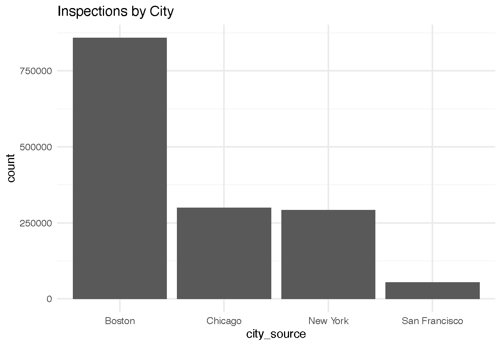 |
| **Risk Differences** | Chicago and New York log a dramatically higher proportion of **High Risk** violations than Boston, demonstrating different regulatory definitions of risk. | 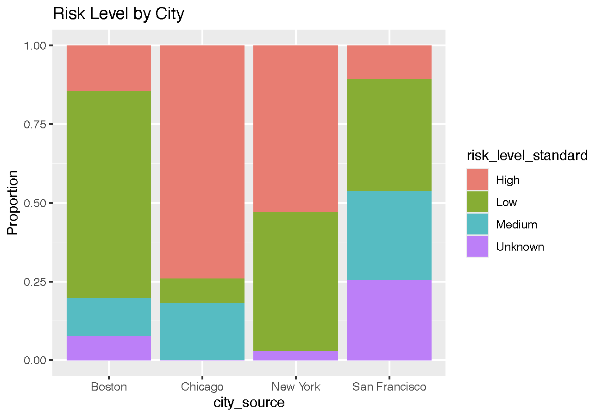 |
| **Score System** | New York uses a demerit system (lower score is better), while San Francisco uses a points-based system (higher score is better). Our logic successfully mapped these opposites into consistent outcomes. | 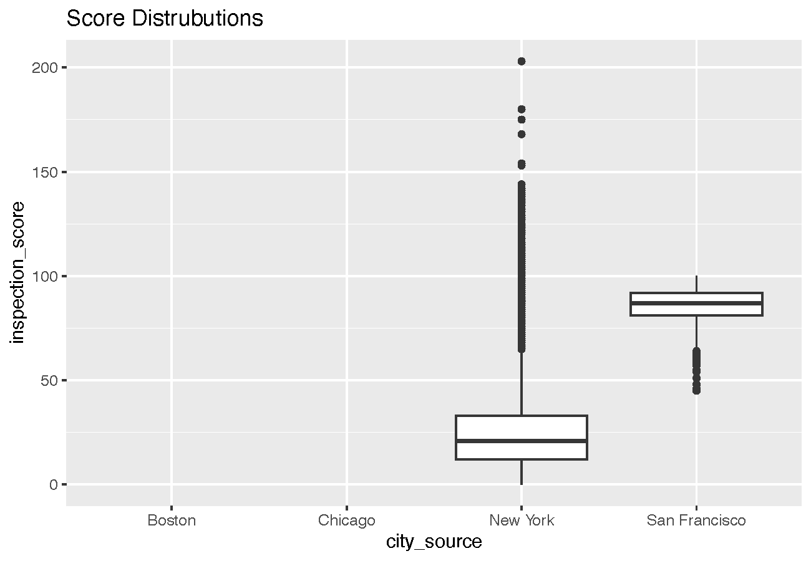 |

------------------------------------------------------------------------

## Results

### Q1. Geographic Violation Patterns (Gian's Analysis)

The geographic analysis focused on **Boston** to identify localized risk factors by comparing clustered ("Urban") restaurants to dispersed ("Suburban") restaurants.

-   **Hotspot Identification:** The restaurant density map revealed significant clustering near major metropolitan areas like the North End, Downtown Crossing, and Chinatown.

-   **Urban/Suburban Pass Rate Test:** A two-category comparison was conducted, designating a restaurant as "Urban" if it had 10 or more neighbors within a 100-meter radius, and "Suburban" otherwise.

    -   **Finding:** The proportion table showed that the Pass Rate for Urban restaurants was **0.8% higher** than for Suburban restaurants. This suggests suburban restaurants tend to fail health inspections slightly more often.
    -   **Significance:** A Chi-Squared Test yielded a p-value of $6.969 \times 10^{-10}$, allowing us to reject the null hypothesis. We have evidence that Urban/Suburban designation and health inspection pass rates **are dependent on one another**.
    -   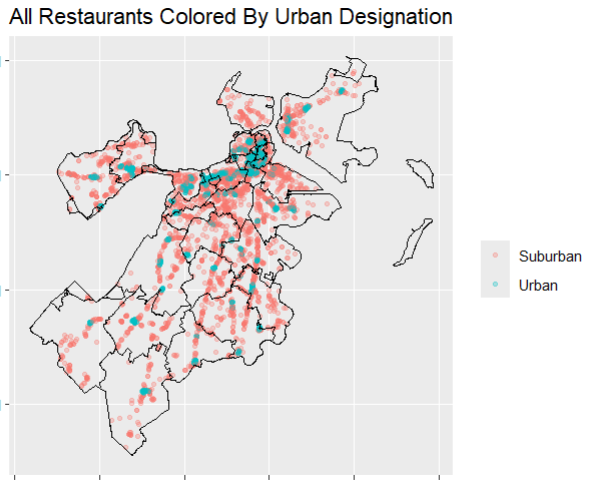

-   **Detailed Relationship:** Below is a scatterplot with a smoothing spline, exploring the relationship between the number of neighbors and the restaurant's average pass rate confirmed the overall trend: there is a slight positive correlation between restaurant clustering and passing rates.

    -   **Confidence:** Although slight, we are **very confident** that this trend exists, as evidenced by the narrowness of the green prediction (standard error never exceeds 2.5%).

    -   **Number of Inspections:** The total number of inspections per restaurant **does not seem to differ** with the number of neighbors, but does differ slightly by pass rate. The larger the number of inspections a restaurant has, the more they tend to hover around a 50% pass rate.

.

### Q2. Restaurant Risk & Inspection Types (Seun's Analysis)

#### 2a. Violation 'Fingerprints' by Restaurant Category

To answer whether specific cuisine types face unique risks, we categorized violations and restaurants. Due to memory limits, the specific text analysis was run using a segmented, aggregated 10% sample of the data.

-   **Top Violation Themes:** The final bigram analysis, which removed common stopwords, revealed that the most frequent violations found by inspectors are not specific health emergencies but **structural, maintenance, and compliance issues** (e.g., "food contact," "contact surfaces," "walls ceilings"). This result validated the necessity of grouping all violations into high-level categories (Sanitation, Pest Control, etc.).
-   **The Fingerprint:** The proportional plot shows a distinct risk profile for each cuisine type:
    -   **Food Temperature Risk:** **Restaurant (General)** is the clear outlier, where Food Temperature makes up the largest non-Sanitation/Pest share (\~25–30% of its violations), suggesting high risk in complex kitchens.
    -   **Pest Control Dominance:** **Sushi/Japanese, Sandwich/Deli, and Bar/Pubs** have the highest *proportion* of **Pest Control** violations (over 25% of their issues).
    -   **Sanitation Focus:** **Coffee/Bakery, Pizza, and Chinese** restaurants are highly dominated by **Sanitation & Cleaning** violations (often exceeding 40%).

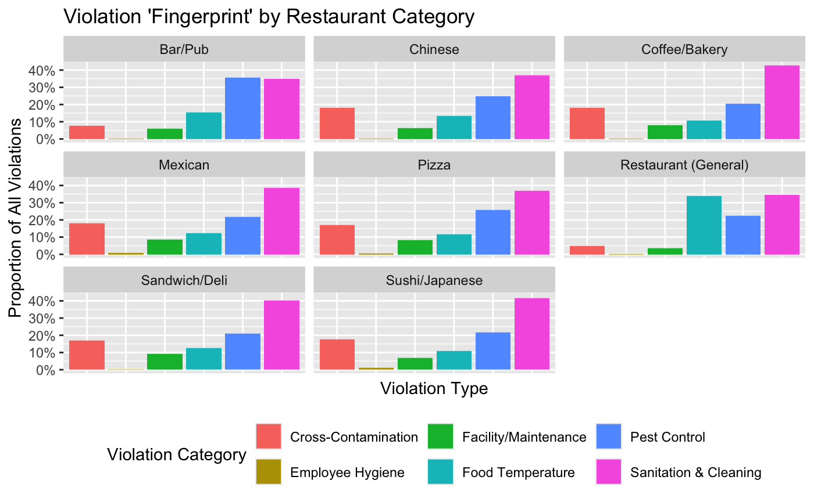

#### 2b. Severity Difference: Complaint vs. Routine Inspections

-   **Violation Severity:** The proportional plot of risk level (High, Medium, Low) confirms that **Complaint-Driven inspections** are significantly more likely to find severe problems. The proportion of **High Risk** violations is visually larger in the Complaint column than in the Routine column. This suggests the public is effective at reporting restaurants that pose an immediate public health risk.
-   **Violation Type:** When comparing violation categories:
    -   **Complaint inspections** are disproportionately focused on **Pest Control** and **Food Temperature** issues.
    -   **Routine inspections** find a much higher proportion of **Sanitation & Cleaning** and **Facility/Maintenance** problems.
    -   This suggests patrons report visible signs of pests, while inspectors uncover structural/hygiene problems during comprehensive checks.

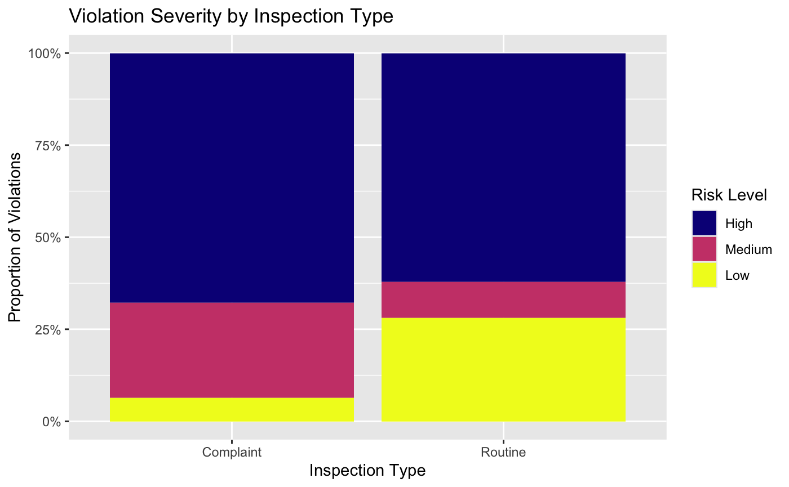

### Q3. Temporal and Seasonal Patterns (Niki's Analysis)

The temporal analysis investigated when and why food inspection violations occur throughout the year, focusing on monthly and seasonal trends across the four major cities.

#### Monthly and Seasonal Peaks

-   **Overall Monthly Peak:** The distribution of food inspection violations across all cities shows a strong bimodal trend, peaking in **March** and **October**. **October** records the highest single monthly volume of violations (around 150k violations). 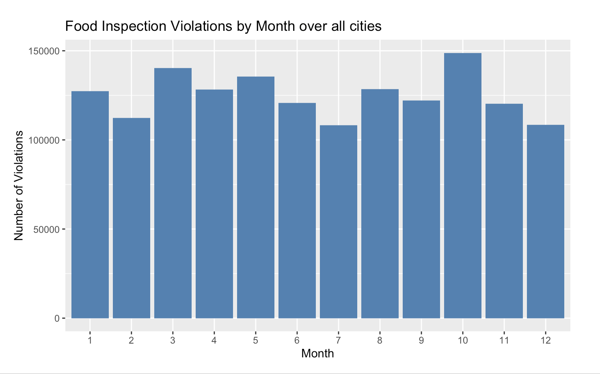
-   **City Consistency:** All cities follow this bimodal pattern of peaks in March and October, confirming a **consistent annual inspection cycle** across the entire dataset .
-   **Seasonal Peak:** Despite the strong October peak, the cumulative violation count is highest in **Spring** . 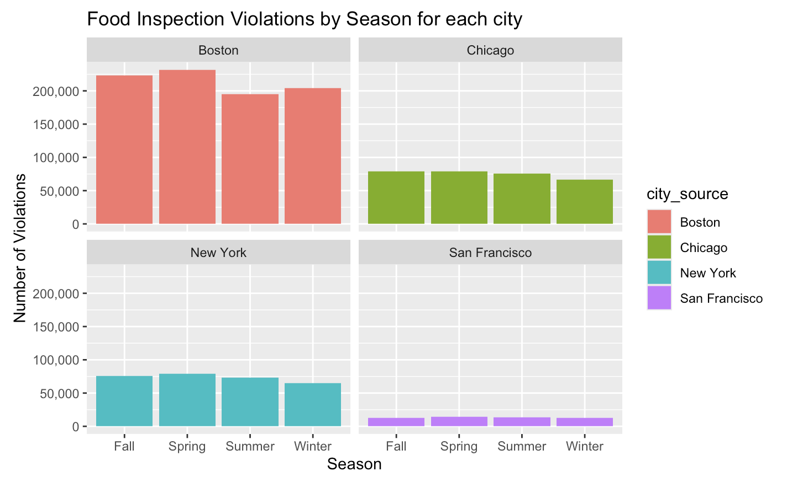 This apparent contradiction is resolved when considering that **Spring spans three months of elevated activity** (March, April, and May), while October represents a single, isolated peak month in Fall. The cumulative effect across the three Spring months results in Spring having the highest total violations overall .

#### Violation Specificity

-   **Pest Control:** **Pest Control** violations peak seasonally in **Fall** . This likely reflects colder outdoor temperatures driving rodents and insects indoors, increasing infestation risks in food establishments.
-   **Employee Hygiene Outlier:** **Employee Hygiene** peaks notably in **April**, potentially reflecting spring staffing changes or training cycles .
-   **Facility/Maintenance and Other:** These violations exhibit bimodal patterns with comparable peaks in both March and October, indicating these issues arise at two distinct points in the annual cycle.
-   **Conclusion:** **Spring** emerges as the period with the highest overall risk, necessitating prioritization for comprehensive inspections and preventive measures. 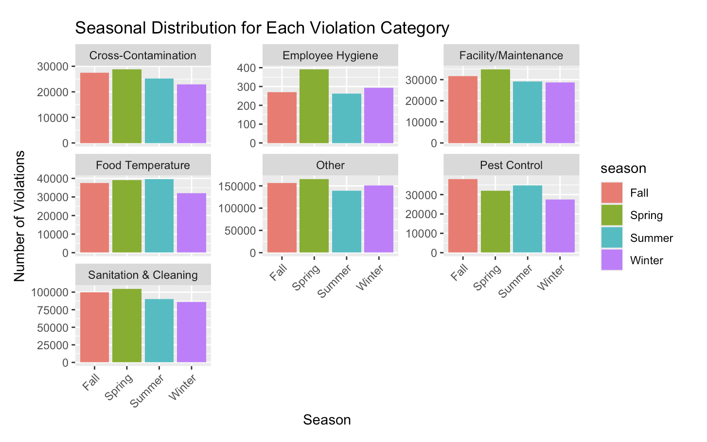 ---

### Q4. Longitudinal Trends (Arohi's Analysis)

The time series analysis examined how the frequency of violations changed over the past two decades, with a focus on the environmental impact of COVID-19 (2015 vs. 2020) on food inspection violations.

-   **Overall Time Trend:** The **"Other"** category has consistently been the most frequent violation type, followed by **Sanitation & Cleaning**. Cross-Contamination and Pest Control are among the least frequent violations over time. An immediate limitation of this is that the Other category is a catch-all bucket representing the categories not included in the analysis. This is due to the imperfect standardization of our data. This explains why it is the largest category. Therefore, we can say **Sanitation & Cleaning** is the more "important" data point here, as it is more representative of the overall data and consistent with our previous findings.

    -   Broken down by year, the leading category in most common violation inspections (**Other**) has been an increasing trend for the past couple years. This has been consistent over the past two decades, with the exception of 2020's effect of COVID-19. The unproportional rise in 2021 and 2022 is explained by the return of the economy post COVID-19, where restaurants and businesses began to reopen in society. 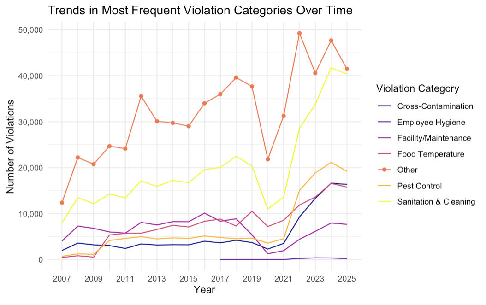

-   **Composition of Violations:** The proportional composition of all violation categories has been relatively steady over the past couple of years, meaning each category has held a similar share proportionally to the others. The large shift in total volume is primarily driven by the **Other** and **Sanitation & Cleaning** categories, which are the most prominent in the inspection space. This is consistent with our previous findings within our longitudinal data analysis, as well. 

-   **COVID-19 Impact (2015 vs. 2020):** As mentioned, I wanted to inspect the effect of environmental circumstances on food inspection violations. My hypothesis is that COVID-19 would shift inspection counts down because less restaurants are open to be inspected. As predicted, inspection counts in 2020 dropped significantly compared to 2015 across almost all categories due to pandemic-related shutdowns and restricted in-person activity.

    -   **Largest Decreases:** The largest numerical decreases were seen in the highest-volume categories: **Other** (decreased by 7,214 counts), **Facility/Maintenance** (decreased by 6,979 counts), and **Sanitation & Cleaning** (decreased by 5,768 counts).
    -   **Unique Increases:** The **Food Temperature** (increased by 85 counts) and **Employee Hygiene** (increased by 6 counts) categories were the *only* categories to see a slight numerical *increase* from 2015 to 2020. This behavior suggests that during the crisis, the limited inspections conducted were highly prioritized, focusing on critical risks like safe temperatures and employee hygiene protocols.

-   **Severity Comparison:** Looking at the severity of violation cases (Fail, Pass, Violation, Closed), the **Other** category consistently holds the highest concentration of violations. Here, the **Other** category reflects administrative statuses or nonstandard outcomes, such as Pending Inspection, Inconclusive, etc. Notably, the **Fail** severity category had the second highest count, exceeding the count of the **Pass** severity category in both 2015 and 2020. 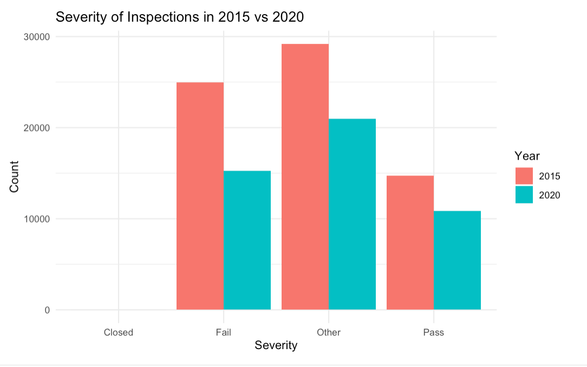

## Limitations

Our analysis above has shown valuable insights about food inspection trends across these 4 major metropolitan cities, there are some limitations that constrained our inspection, interpretation and generalization of the findings.

The cleaned dataset is highly imbalanced in terms of proportions of data points each city provided to the ultimate dataset. While Boston contributed more than half the records in the final dataset, San Francisco and Chicago have significantly less observations. This imbalance creates an issue of misrepresenting generalizable patterns in the data, which is why we emphasized a proportional analysis of our dataset rather than absolute numbers. A proportional analysis allows our findings to be warranted with recognizing Boston's domination of broader trends.

There was also a difference in inspection systems and reporting standards in our analysis. Each city used different terms for their violation codes, scoring systems, categories, and more. For example, while NYC used a demerit-based score, San Francisco allocated points for scoring. Because of this, some trends may be skewed because of inconsistent reporting. So, we needed to create a final cleaned dataset by standardizing the columns and data points for our to make the values consistent for our analysis. Even with this, it is impossible to guarantee full 100% accuracy in our findings, which we acknowledge here in our limitations section.

In our longitudinal trend analysis, Other remains the largest category in most of the analyses. This is due to the fact that some violation descriptions across cities cannot be directly mapped cleanly into categories. This limits the specificities of our conclusions for that section. It also reduces its ability to be interpreted generally across cities. For the future, we would attempt to further categorize these violation descriptions so that we could eliminate the Other category altogether, which would allow us to identify city-specific or category-specific trends.

A final limitation we saw within our analyses was our lack of accounting for other contextual and environmental variables. We understood that were some external factors that likely also could have an influence on food inspection violations that were omitted because they were not universally included in all four datasets. This could include restaurant size (seating capacity), restaurant chain vs independent restaurant, inspection frequency per restaurant, neighborhood demographics, and more. Because of this, we decided to focus on the factors that we could attribute trends to, like seasonality, geography, risk, and severity.

With additional time, richer contextual data, and a deeper standardization between cities and terms, we would build a more comprehensive and complex analysis of the trends and findings related to food inspection.

## Conclusion

This investigation examined food inspection records from several different angles: geospatial calculations, bigram patterns via restaurant type, seasonal trends through violation category, and longitudinal trends over \~20 years. "Sanitation & Cleaning," "Pest Control," "Food Temperture" and spring-season violations stood out as the most persistent and impactful trends across cities and restaurant types.

In Boston, restaurants with more nearby neighbors were slightly more likely to pass inspection. The trend is statistically clear but weak, amounting to only about a 0.8% increase in pass rate per additional neighboring restaurant. It remains uncertain whether suburban restaurants truly have more violations or whether urban inspections are conducted more rigorously.

Across Boston, New York, Chicago, and San Francisco, Sanitation & Cleaning was the most frequent violation type across nearly all establishment categories. The primary exception was Bars/Pubs, which had more Pest Control violations. Restaurants in general were particularly prone to Food Temperature violations. Complaint-driven inspections also revealed more high-risk violations than routine inspections.

Violation types also varied by season. Pest Control violations peaked in the fall across all cities, while Sanitation, Employee Hygiene, and Facility/Maintenance violations peaked in the spring—the season with the second-highest inspection volume (after fall, especially October). Over the past 18 years, total violations consistently increased, aside from a temporary drop during the COVID-19 pandemic. Post-pandemic, violations rose again, especially in Sanitation & Cleaning, Pest Control, and Cross-Contamination.

These findings point to several policy implications. For immediate risk mitigation, more resources should be directed toward complaint-driven inspections and spring inspections, both of which uncover higher rates of severe violations. For prevention, pest-control efforts should be expanded during the fall and for bars/pubs year-round. Because Sanitation & Cleaning violations are consistently the most common—and Food Temperature issues are especially common in restaurants—both immediate and long-term interventions should prioritize these areas, including strengthened employee training. Location-based pass-rate differences exist but are small and should not be prioritized.

Future research should focus on inspection methodology, including training protocols and inspector-level consistency. Understanding how inspections are conducted across restaurant types, locations, and seasons would strengthen the reliability of these findings and support more precise, effective policy interventions.

## References

Pavelich, P. (2025, September 10). Board of Health Suspends Bamboo Restaurant’s Permit Amid Food Safety Violations [Review of Board of Health Suspends Bamboo Restaurant’s Permit Amid Food Safety Violations]. The Bedford Citizen. <https://thebedfordcitizen.org/2025/09/board-of-health-suspends-bamboo-restaurants-permit-amid-food-safety-violations/>
