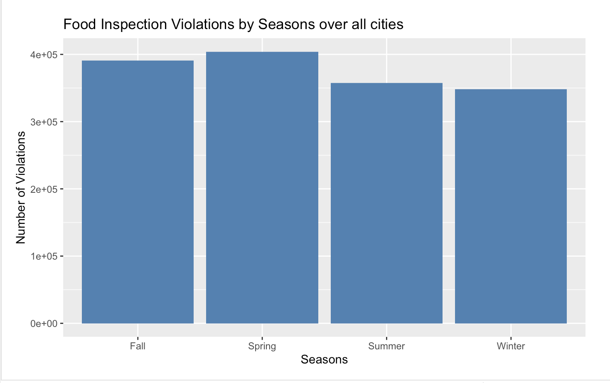
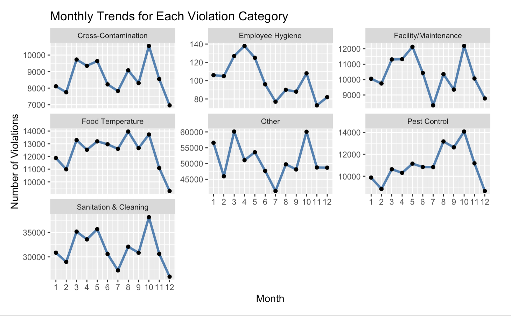

## Introduction
  In September 2025, the Bedford Board of Health made the decision to suspend Bamboo's restaurant permit.
This decision was made after numerous attempts of correcting the health violations and even employing a food safety consultant.
Bamboo was found violating many food safety standards, the article by The Bedford Citizen states, "issues involving storage, temperature control, cross-contamination, 
equipment cleanliness, cold and hot holding, and pH testing"(Pavelich, 2025). Such violations pose serious risks to public health, as improper food handling and sanitation can lead to foodborne illness and community-wide exposure. 
This recent event demonstrates how serious the consequences of repeated noncompliance can be and highlight the importance of routine inspections, regulatory oversight, and early intervention. 

  For our project we wanted to analyze inspection data to better when and why violations might occur. 
We did this by examining violations from food establishments in Boston, New York City (NYC), Chicago, and San Francisco. The dataset consists of thousands of food inspection records from publicly available health department data in Boston, New York City, Chicago, and San Francisco. 
These records include information such as inspection dates, violation types, risk levels, etc. Our final dataset, after merging, had around 1.5 millions records, spanning twenty years.
In this data, we are looking to compare, contrast, and find relationships between variables related to common overall violations within each city, year, 
type of establishment, type of violation, and other variables. 

  Our setup looks to be for each of us to thoroughly 
research and analyze an individual question related to common food establishment violations. 
Our research questions are as follows:

Q1. What is the pattern of violations geographically within each city? For example, what zipcodes have the most prominent one?

Q2. Do specific categories of restaurants (e.g., 'Pizza', 'Sushi', 'Coffee Shop') disproportionately receive certain categories of violations (e.g., 'Pest Control', 'Food Temperature', 'Employee Hygiene')?
  
  - How do the types and severity (risk level) of violations found during 'Complaint-Driven' inspections differ from those found during 'Routine' inspections?

Q3. What month and season has the most food inspection violations across each city? Overall?
  
  - When do certain types of violations (e.g., temperature issues, pests, hygiene) peak?

Q4. What is the trend of most frequent violations been over time? For example, what are the most common violations in 2015 overall vs in 2020? Why?

We used several libraries to complete data cleaning and visualization including including tidyverse, sf, lubridate, tidytext, scales, viridis, and ggplot2.

## Exploratory Data Analysis

## Results
# Q1
# Q2
# Q3

In order to figure when violations are peaking, we first looked at the amount food violations over the course of the year.The first plot shows the distribution of food inspection violations across all cities over the course of the year. 
Violations tend to peak in March and October, with October having the highest number of violations with around 150k violations. 

From there we wanted to look if there was any differences between each of the cities. The second plot breaks the data down by city, and we found all of them follow a similar pattern, with peaks in March and October.
This is consistent with the overall trend observed in the previous plot.

For this part of the analysis, we looked at which seasons food violations tend to peak. This plot shows the distribution of food inspection violations across all cities over the seasons. 
Unlike the monthly plots, this plot found that the most violations were peaking in the season of spring. This suggests violations seem to follow a seasonal trend, with more problems in spring, rather than being random spikes in individual months. 

We further broke down the data by city and observed that each of the cities followed a similar pattern, with spring being the season with the most violations.
This is consistent with the overall trend observed in the previous plot.

After examining each violation category separately, we observe that different types of violations peak at different times throughout the year. Cross-Contamination, Sanitation & Cleaning, and Pest Control all reach their highest levels in October, suggesting these categories may share common drivers during this month.
However, other categories follow distinct monthly patterns. Employee Hygiene peaks notably in April rather than fall, potentially reflecting spring staffing changes or training cycles. 
Food Temperature shows its highest violations in October but maintains elevated levels across several months. Facility/Maintenance and Other violations exhibit bimodal patterns with comparable peaks in both March and October, 
indicating these issues arise at two distinct points in the annual cycle. These varied monthly patterns suggest that different violation types respond to different temporal factors, 
which could inform more strategic scheduling of targeted inspections throughout the year

The seasonal distribution reveals a clear pattern: six of the seven violation categories reach their highest levels during spring, despite October (a fall month) showing the highest violations in the monthly analysis. 
This apparent contradiction is resolved when considering that spring spans three months of elevated activity, while October represents a single peak month within fall. 
The cumulative effect across March, April, and May results in spring having the highest total violations for most categories.
Pest Control is the notable exception, peaking in fall rather than spring. This likely reflects colder outdoor temperatures driving rodents and insects indoors, 
increasing infestation risks in food establishments. Food Temperature violations show less seasonal variation than other categories, remaining fairly consistent throughout the year with a slight peak in summer.
Overall, spring emerges as the period with the most violations across nearly all categories, suggesting it should be a priority time for inspections and preventive measures.

# Q4

## Limitations

## Conclusion

## References

Pavelich, P. (2025, September 10). Board of Health Suspends Bamboo Restaurant’s Permit Amid Food Safety Violations [Review of Board of Health Suspends Bamboo Restaurant’s Permit Amid Food Safety Violations]. The Bedford Citizen. https://thebedfordcitizen.org/2025/09/board-of-health-suspends-bamboo-restaurants-permit-amid-food-safety-violations/
